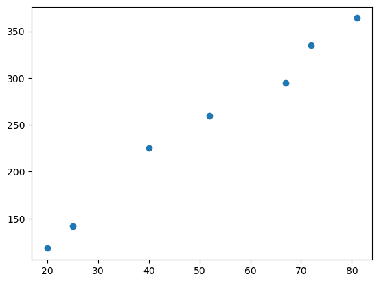

Este projeto foi um desafio proposto por um curso de Machine Learning.  
Deveríamos pegar uma base de dados que continha os investimentos em marketing feitos pela empresa, as vendas geradas pelo investimento e relacionar os dados de modo a responder a seguinte questão dada por nosso gerente:  
<strong>- Qual seria o retorno em vendas caso investíssemos R$75.000,00 ?</strong>  
<H1>Métodos</H1>  
 - Levantei os dados da empresa e tabulei fazendo uma relação de Investimento em Mkt X Vendas.  
 - Aplique aos dados um gráfico de dispersão e pude perceber que os dados são grandezas diretamente proporcionais: sempre que cresce o investimento em marketing crescem as vendas.  
 
